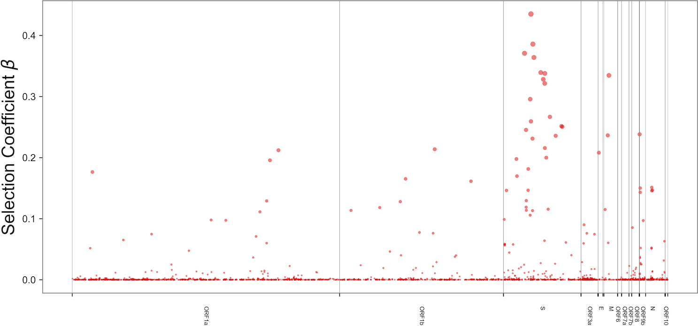

[](https://github.com/broadinstitute/bvas/actions)
[](https://broadinstitute.github.io/bvas/)





# BVAS: Bayesian Viral Allele Selection 

Welcome to the GitHub repository for [*Inferring selection effects in SARS-CoV-2 with Bayesian Viral Allele Selection*](https://journals.plos.org/plosgenetics/article?id=10.1371/journal.pgen.1010540). The results from our main analysis are available in [paper](paper/). More recent inference results are also available: [08.10.22](paper/08.10.22/),
 [09.22.22](paper/09.22.22/), [05.18.23](paper/05.18.23/), [06.15.23](paper/06.15.23/), [06.30.23](paper/06.30.23/), [09.13.23](paper/09.13.23), [09.20.23](paper/09.20.23), [11.03.2023](paper/11.03.23), and [11.29.2023](paper/11.29.23).
Thanks to Benjamin Kotzen ([@bkotzen](https://www.github.com/bkotzen)) for help generating these more recent results!


## Requirements

BVAS requires Python 3.8 or later and the following Python packages: [PyTorch](https://pytorch.org/), [pandas](https://pandas.pydata.org/), and [pyro](https://github.com/pyro-ppl/pyro).

Note that if you wish to run BVAS on a GPU you need to install PyTorch with CUDA support.
In particular if you run the following command from your terminal it should report True:
```
python -c 'import torch; print(torch.cuda.is_available())'
```


## Installation instructions

Install directly from GitHub:

```pip install git+https://github.com/broadinstitute/bvas.git```

Install from source:
```
git clone git@github.com:broadinstitute/bvas.git
cd bvas 
pip install .
```


## Documentation

The documentation is available [here](https://broadinstitute.github.io/bvas/).


## Repo organization 

This repo is organized as follows:
 - [bvas](bvas/): all the core code: inference algorithms and simulations
 - [paper](paper/): some of the figures and inference results contained in the paper 
 - [notebooks](notebooks/): Jupyter notebooks demonstrating BVAS usage
   - [basic_demo.ipynb](notebooks/basic_demo.ipynb): demo using simulated data 
   - [S_gene_demo.ipynb](notebooks/S_gene_demo.ipynb): demo using GISAID data restricted only to the SARS-CoV-2 S gene
 - [data](data/): pre-processing scripts and (some of the) data used in the analysis
 - [docs](docs/): source code for the documentation 
 - [example_scripts](example_scripts/): example scripts that demo BVAS usage 
 - [tests](tests/): unit tests for verifying the correctness of inference algorithms and other code
